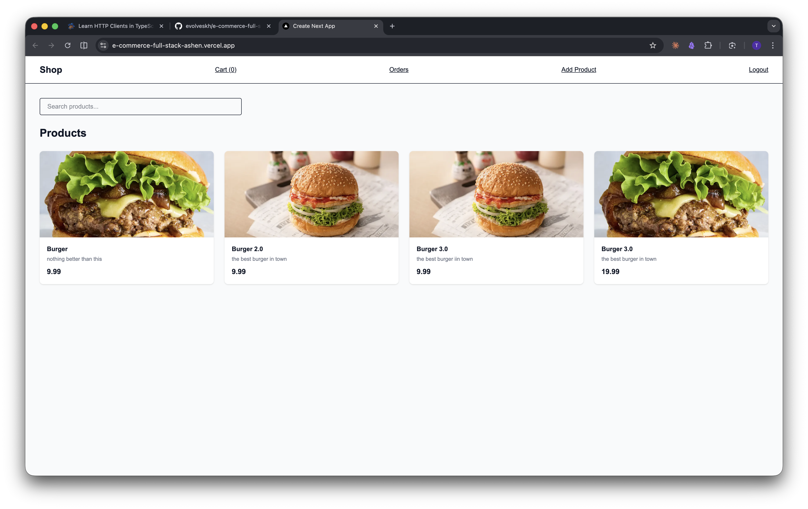
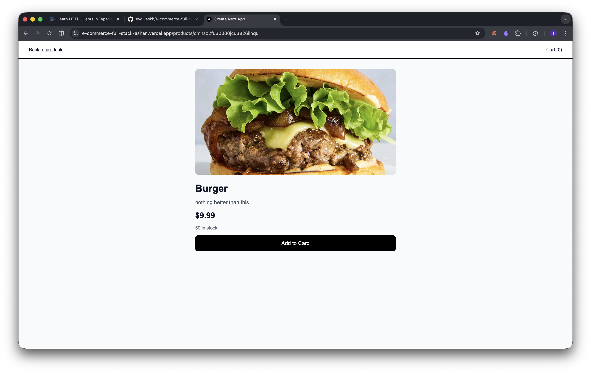
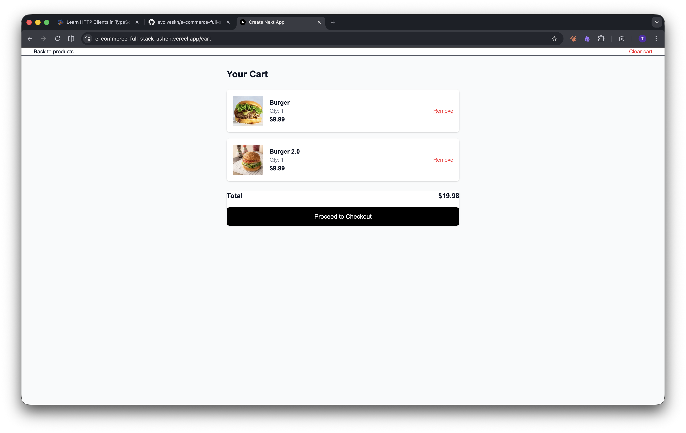
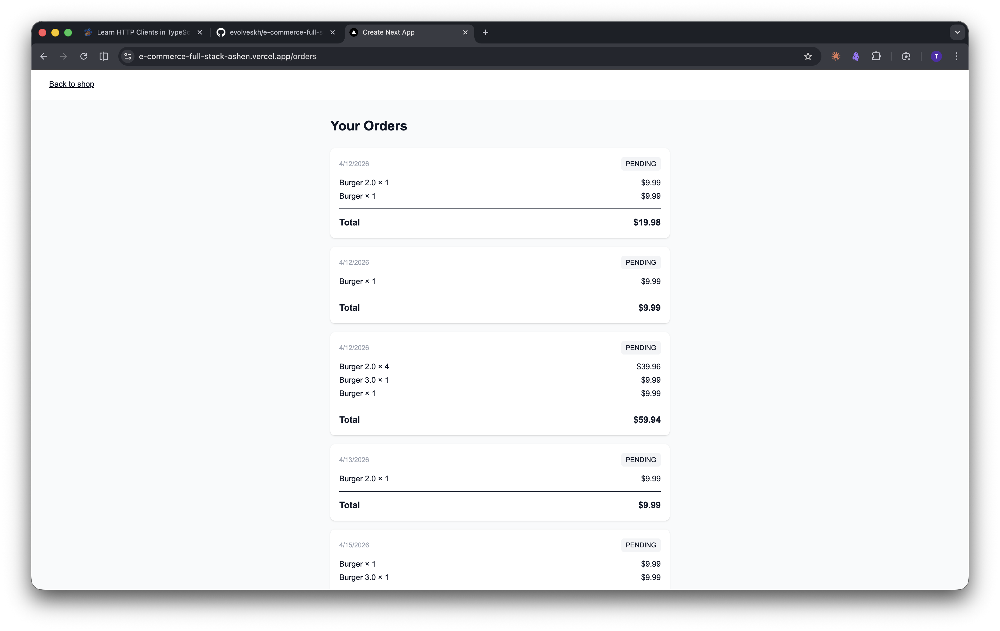

# e-commerce-full-stack

A full-stack e-commerce application built with Node.js, Express, Prisma, and Next.js.

## Live Demo

- Frontend: https://e-commerce-full-stack-ashen.vercel.app
- Backend: https://e-commerce-full-stack-38a6.onrender.com

## Screenshots

### Products


### Product Details


### Cart


### Checkout


### Order History


## Stack

**Backend**
- Node.js + Express — HTTP server
- TypeScript — type safety
- Prisma 7 — ORM
- Neon — serverless Postgres
- Zod — request validation
- JWT — authentication
- Cloudinary — image uploads

**Frontend**
- Next.js 16 + React 19
- TypeScript
- Tailwind CSS
- Axios — API client

## Features

- User registration and login
- JWT authentication
- Product CRUD with image upload
- Order management
- Client-side search
- Cart with localStorage
- Input validation

## Getting Started

### Backend

```bash
cd backend
bun install
bun run dev
